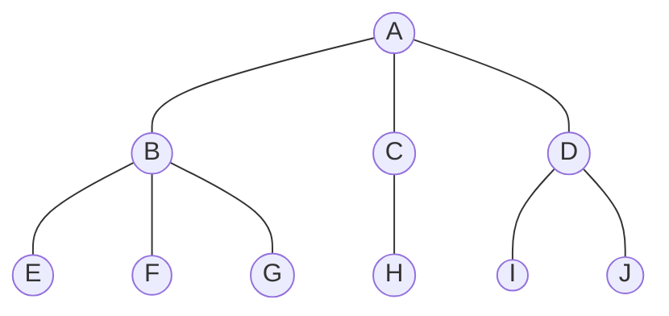
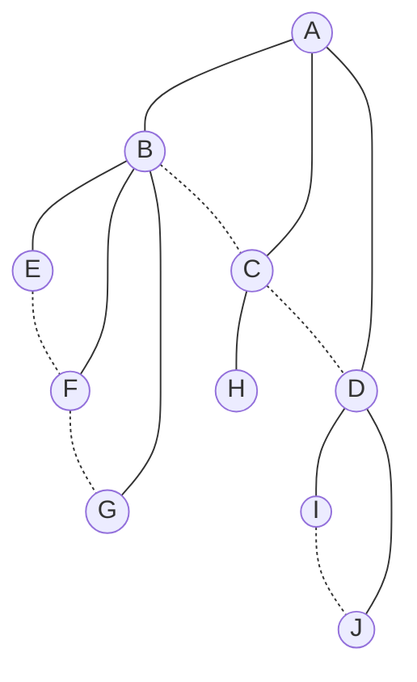
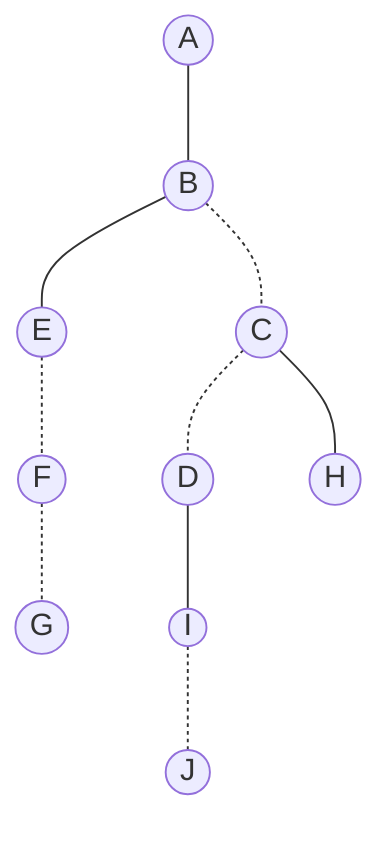

# 树(tree)


## 1. 树(tree)

### 1.1 概念

#### 1.1.1 树的定义

- 树（Tree）是 n(n >= 0) 个结点的有限集。

- n = 0 时称为空树。

- 在任意一颗非空树中：
  - 有且仅有一个特定的称为根（root）的结点
  - 当 n > 1 时，其余结点可分为 m(m>0) 个互不相交的有限集 T1 、T2 ... Tn ，其中每一个集合本身有事一棵树，并且称为根的子树（SubTree)

#### 1.1.2 树的分类

- 树的结点包含一个数据元素及若干指向其子树的分支；
- 结点拥有的子树数称为结点的度（Degree）；
- 度为0的结点称为叶结点（Leaf）或终端结点；
- 度不为0的结点称为非终端结点或分支结点；
- 除根结点之外，分支结点也称为内部结点。
- 树的度是树内各结点的度的最大值；


#### 1.1.3 结点间关系

- 结点的子树的根称为该结点的孩子**（Child）**
- 该结点称为孩子的双亲**（Parent）**
- 同一个双亲的孩子之间互称兄弟**（Sibling）**。
- 结点的祖先是从根到该结点所经分支上的所有结点。
- 以某结点为根的子树中的任一结点都称为该结点的子孙。


#### 1.1.4 其他概念

- 结点的层次**（Level）**
  - 根为第一层，根的孩子为第二层，依次类推。
  - 树中结点的最大层次称为树的深度（Depth）或高度
- 如果将树中结点的各子树看成从左至右是有次序的，不能互换的，则称该树为**有序树**，否则称为**无序树**。
- **森林（Forest）**是m（m>0）棵互不相交的树的集合。对树中每个结点而言，其子树的集合即为森林。


### 1.2 树的抽象数据类型

```c
ADT树(tree)
	Data树是由一个根结点和若干棵子树构成。树中结点具有相同数据类型及层次关系。
Operation 
	InitTree(*T):构造空树T。
	DestroyTree(*T):销毁树T。
	CreateTree(*T,definition):按definition中给出树的定义来构造树。
	ClearTree(*T):若树T存在,则将树T清为空树。
	TreeEmpty(T):若T为空树,返回true,否则返回false。
	Treepepth(T):返回T的深度。
	Root(T):返回T的根结点。
	Value(T,cur_e):cur_e是树T中一个结点,返回此结点的值。
	Assign(T,cur_e,value):给树T的结点cur_e赋值为value。
	Parent(T,cur_e):若cur_e是树T的非根结点,则返回它的双亲,否则返回空。
	Leftchild(T,cur_e):若cur_e是树T的非叶结点,则返回它的最左孩子,否则返回空。
	RightSibling(T,cur_e):若cur_e有右兄弟,则返回它的右兄弟,否则返回空。
	InsertChild(*T,*p,i,c):其中p指向树T的某个结点,i为所指结点p的度加上1,非空树c与T不相交,操作结果为插入c为树T中p指结点的第棵子树。
	Deletechild(*T,*p,i):其中p指向树T的某个结点,i为所指结点p的度,操作结果为删除T中p所指结点的第i棵子树。
endADT
```


### 1.3 树的存储结构

#### 1.3.1 双亲表示法

**在每个结点中，附设一个指示器指示其双亲结点到链表中的位置**

这种设置，我们可以很快找到结点的根节点，但是想要找到子结点，只能通过遍历整个结构，所以为了解决该问题，可以为其结点增加**长子域，右兄弟**域等等


#### 1.3.2 孩子表示法

##### 1.3.2.1多重链表表示法

**每个结点设置多个指针域，其中每个指针指向一颗子树有的根节点，我们吧这种方法叫做多重链表表示法**

由于树的每个结点的度是不同的，所以有以下两种方案来解决

###### 1.3.2.1.1 方案一（固定大小的指针域）

**用树的度作为作为指针域的大小去构建结点（树的度：树内各结点的度的最大值）**

以这种方案去构建，当树内各个结点的度相差比较远的时候，会造成空间浪费，相反，当树内各个结点的度相差比较小的时候，则该存储结构有更高的优势（减少运算）


###### 1.3.2.1.2 方案二（按需分配的指针域）

**每个结点指针域的个数等于该结点的度，用一个位置来存储结点指针域的个数**

这种方法克服了浪费空间的缺点，对空间利用率提高了，但是由于各个结点的链表结构式不同的，加上要维护结点的度的数值，运算上会带来时间上的损耗

##### 1.3.2.2 孩子表示法

**把每个结点的孩子结点排列起来，以单链表作存储结构，则 n 个结点有 n 个孩子链表，如果叶子结点则此单链表为空。然后 n 个头指针又组成一个线性表，采用顺序存储结构，存放进一个一维数组中**


#### 1.3.3 双亲孩子表示法

孩子表示法对于查找孩子的双亲比较麻烦，于是结合孩子标识法和双亲表示法，构建一个双亲孩子表示法

**在孩子表示法中增加存放双亲结点指针的指针域**


## 2. 二叉树（Binary Tree)

**二叉树是 n ( n >= 0 ) 个结点的有限集合，改集合或者为空集（称为空二叉树），或者由一个根结点和两颗互不想交的、分别称为根结点的左子树和右子树的二叉树组成**

### 2.1 二叉树的特点

- 特点：
  - **每个结点最多有两棵子树**，所以二又树中不存在度大于2的结点。注意不是只有两棵子树，而是最多有。没有子树或者有一棵子树都是可以的。
  - **左子树和右子树是有顺序的，次序不能任意颠倒**。就像人是双手、双脚，但显然左手、左脚和右手、右脚是不一样的，右手戴左手套、右脚穿左鞋都会极其别扭和难受。
  - **即使树中某结点只有一棵子树，也要区分它是左子树还是右子树**。

- 形态：
  - 空二叉树
  - 只有根结点
  - 只有一个左子树
  - 只有一个右子树
  - 既有左子树，又有右子树

### 2.2 特殊二叉树

#### 2.2.1 斜树

**所有的结点都只有左子树的二叉树叫左斜树。所有结点都是只有右子树的二叉树叫右斜树。这两者统称为斜树。**


#### 2.2.2 满二叉树

**在一颗二叉树中，如果所有分支结点都存在左子树和右子树，并且所以叶子都在同一层中**


#### 2.2.3 完全二叉树

**对一棵具有 n 个结点的二叉树按层序编号，如果编号为 i（1 < i < n）的结点与同样深度的满二又树中编号为i的结点在二又树中位置完全相同，则这棵二叉树称为完全二叉树**

- 叶子结点只能出现在最下两层。
- 最下层的叶子一定集中在左部连续位置。
- 倒数二层，若有叶子结点，一定都在右部连续位置。
- 如果结点度为1，则该结点只有左孩子，即不存在只有右子树的情况。
- 同样结点数的二又树，完全二叉树的深度最小。


### 2.3 二叉树的性质

**性质1:**
$$
在二叉树的 i 层上最多结点数 = 2^{i-1}(i \geq 1)
$$
**性质2：**
$$
深度为k的二叉树至多有 2^K-1(K \geq 1) 个结点
$$
**性质3：**
$$
对任何一棵二又树 T，如果其终端结点数(叶子数)为 n_0，度为 2 的结点数为 n_2，则 n_0 = n_2 + 1 
$$
**性质4：**
$$
具有 n 个结点的完全二叉树的深度为 [log_2n] + 1 ([x] 表示不大于 x 的最大值)
$$
**性质5：**
$$
如果对一颗有 n 个结点的完全二叉树（其深度为[log_2n]+1)的结点按层序编号\\
（从第1层到低[log2n]+1层，每层从左到右），对任一结点 i（1 \leq i \leq n)有：\\
1.如果 i=1,则结点 i 是二叉树的根，五双亲；如果 i > 1,则其双亲是结点[i/2] \\
2.如果 2i>n ,则结点 i 无左孩子（结点i为叶子结点）；否则其左孩子是结点 2i； \\
3.如果 2i+1>n,则结点i无右孩子；否则其右孩子是结点2i+12 \\
$$


### 2.4 二叉树的存储结构

#### 2.4.1 顺序存储结构

#### 2.4.2 链表存储结构


### 2.5 二叉树的遍历(traversing binary tree)

****

**二叉树的遍历是指从根结点出发，按照某种*次序*依次*访问*二叉树中所有结点，使得每个结点被访问一次且仅被访问一次**


#### 2.5.1 前序遍历

**规则是若二叉树为空，则空操作返回，否则先返回根结点，然后前序遍历左子树，再遍历右子树。上图的前序遍历顺序为：ABDGHCEIF**


#### 2.5.2 中序遍历

**规则是若二叉树为空，则空操作返回，否则从根结点开始（注意并不是先访问根节点），中序遍历根节点的左子树，然后访问根结点，最后中序遍历右子树。上图的中序遍历顺序为：GDHBAEICF**


#### 2.5.3 后序遍历

**规则是若二叉树为空，则空操作返回，否则从左到右先叶子后结点的方式遍历左右子树，最后访问根节点。上图的后续遍历顺序为：GHDBIEFCA**


#### 2.5.4 层序遍历

**规则是若二叉树为空，则空操作返回，否则从树的第一层，也就是根节点开始访问，冲上而下逐层遍历，在同一层中，按从左到右的顺序对结点逐个访问。上图的层序遍历顺序为：ABCDEFGHI**


#### 2.5.5 推导树的结构

- 已知前序遍历序列和中序遍历序列，可以唯一确定一棵二叉树。
- 已知后序遍历序列和中序遍历序列，可以唯一确定一棵二叉树。


### 2.6 二叉树的建立

与二叉树的遍历一致


### 2.7 线索二叉树

**这种指向前驱和后继的指针称为线索，加上线索的二叉链表称为线索链表，相应的二又树就称为线索二又树（Threaded Binary Tree）。**


使为空的左孩子指针指向该结点的前驱，为空的右孩子指针指向该结点的后继；并设置标记，ltag 和 rtag ，为 0时指向孩子，为 1 时指向前驱、后继。（主要是为了充分利用空指针域）


## 3. 树、森林、二叉树的转换


### 3.1 树转二叉树

**步骤：**

1. 加线。在所有兄弟结点之间加一条连线。
2. 去线。对树中每个结点，只保留它与第一个孩子结点的连线，删除它与其他孩子结点之间的连线。
3. 层次调整。以树的根结点为轴心，将整棵树顺时针旋转一定的角度，使之结构层次分明。注意第一个孩子是二叉树结点的左孩子，兄弟转换过来的孩子是结点的右孩子。


**树：**



**变化过程-连线：**



**变化过程-删除连线：**



### 3.2 森林转二叉树

**步骤：**

1. 把每个树转换为二又树。
2. 第一棵二叉树不动，从第二棵二叉树开始，依次把后一棵二叉树的根结点作为前一棵二叉树的根结点的右孩子，用线连接起来。当所有的二又树连接起来后就得到了由森林转换来的二叉树。


### 3.3 二叉树转树

**步骤：**

1. 加线。若某结点的左孩子结点存在，则将这个左孩子的右孩子结点、右孩子的右孩子结点、右孩子的右孩子的右孩子结点……哈，反正就是左孩子的 n 个右孩子结点都作为此结点的孩子。将该结点与这些右孩子结点用线连接起来。
2. 去线。删除原二叉树中所有结点与其右孩子结点的连线。
3. 层次调整。使之结构层次分明。


### 3.4 二叉树转森林

**判断一棵二又树能够转换成一棵树还是森林**，标准很简单，那就是只要看这棵二又树的根结点有没有右孩子，有就是森林，没有就是一棵树。那么如果是转换成森林，**步骤**如下：

1. 从根结点开始，若右孩子存在，则把与右孩子结点的连线删除，再查看分离后的二叉树，若右孩子存在，则连线删除……，直到所有右孩子连线都删除为止，得到分离的二叉树。
2. 再将每棵分离后的二又树转换为树即可。


### 3.5 赫夫曼树

【贪心算法】